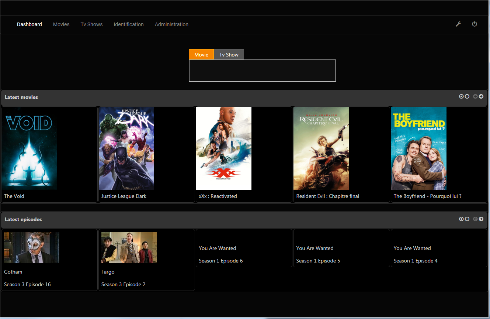
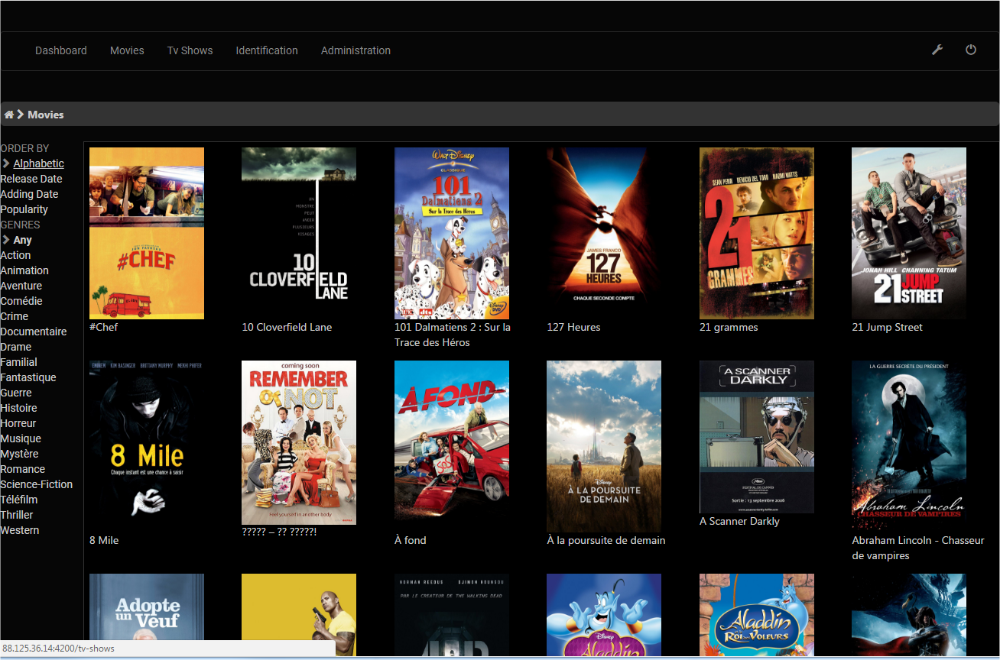
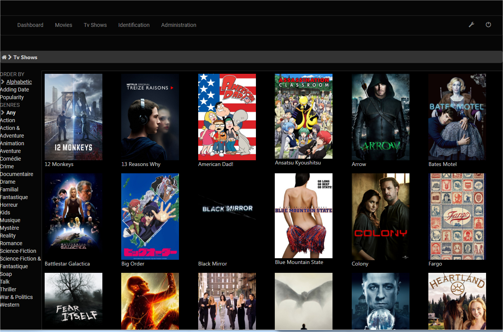

# Freebird
  **Freebird** is a cross-platform media-center-like application that gather media informations on multiple **open-directories**. It permits to search, sort and filter on movies/tv shows stored on the different open-directories on a simple web interface.

** *Note: The source code is located on the 2 branches 'freebird-server' and 'freebird-web'* **

# Screenshots
### Main

**For more screenshots, consult [SCREENSHOTS.md](SCREENSHOTS.md)**

# Architecture
  The application is split into distinct parts:
  - **Server** : explores sites, scrapes medias and provides a secure REST API
  - **Client** : a web interface
  
# Technologies
* Server: developed in Java 8, using 
  * Spring (Boot, JPA, Security, Data)
  * Jsoup
  * themoviedb api
  * Running on an embedded Jetty server
* Client: developed in Angular 4 (based on Angular CLI 1.0.0)

# Web Interface
* **Dashboard**: main page showing latest movies/episodes and a search bar
* **Movies**
* **Tv Shows**
* **Identification**: Permits to the user to identify unknown medias in order to retrieve them in movies / tv shows section.
* **Administration panel**: Admin restricted area permitting to add sites and users and manually scan sites
	
# Quick Start
  The following guide explains how to start locally the application with a local H2 database.
  To deploy and allow external connection, check the **WIKI**.

### Minimal requirements
* JAVA jre 8 or >
* A web server (Apache, Nginx)
* Create an account on https://www.themoviedb.org and get your API Key v3

### Download and extract the latest release, the archive contains
* a directory **freebird-server**: Freebird.X.X.X.jar and a sub folder “config”
* a directory **freebird-web**:  Compiled files ready to be deployed on a web server (Nginx, Apache...)

### Copy the content of "freebird-web" folder in your "www" directory.

### Configure the server
  * Open the file config/application.yml
  * Adapt the following values:
    * **jwt.secret**: Replace by an unique word, this value will be used a key to generate the authencation token. It can be anything but it’s highly recommended to change it in order to improve the security.
    * **themoviedatabase.apiKey.v3**: Put here YOUR Api Key V3 provided by themoviedb.org
    * **themoviedatabase.lang**: you can also change the default language. The title and synopsis of the medias will be in this language.
**Important note: Do not change the identation in this configuration file.**

### Start the server
  Type the command:
  `java -Dspring.profiles.active=h2 -jar Freebird.X.X.X.jar`

### Access to the web app
  * Once the server started, access to http://localhost/ in your favorite browser. The default user is admin / admin.
  * Access to “Administration”, tab “Sites” 
  * Add a site and tick “scan now”
  * Click on “Add“
  * After few seconds, some movies and tv show should be present in Movies/Tv Shows sections.
